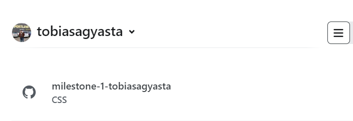
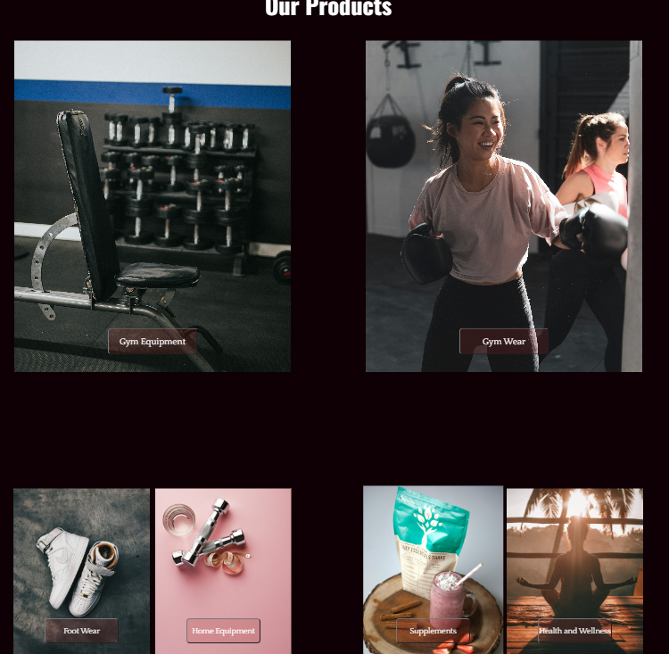

# Striver

### Milestone 1 Assignment for RevoU FSSE Amsterdam

#### By Tobias Agyasta (Team 2)

[**STRIVER Website Link**](https://tobiashalomoan.site)

## How to Open

### Deploying Manually

Using git, you can clone the repository using the following command in git bash on your preferred local folder:

```console
git clone https://github.com/RevoU-FSSE-4/milestone-1-tobiasagyasta.git
```

Then, you can use the [Live Server](https://marketplace.visualstudio.com/items?itemName=ritwickdey.LiveServer) to view the webpage locally through Visual Studio Code

If you want to update the codebase, you can update the code, and the push the changes using

```console
git add .
git commit -m "Some commit message"
git push
```

### Deploying through Netlify and Connecting a Custom Domain

In order to deploy from Github to Netlify, and connect my project to a custom domain, here are the steps that I took:

1. With my Github account, I signed up to [Netlify](https://app.netlify.com/signup), a development platform used to build and deploy websites.

<kbd></kbd>

2. After logging in, I selected the **Add new site** option and selected **Import an existing project**

<kbd></kbd>

3. I select **Deploy with Github**

<kbd></kbd>

4. Then, I selected the project repo to be deployed. In this case, I forked on the repo to my public repo so I can have full control of the deployment.

<kbd></kbd>

5. I have enabled auto-deployment in Netlify, and the app will automatically deploy the website every time a new commit was pushed from me.

<kbd></kbd>

6. Then, I went and bought my custom domain through [Niagahoster](https://www.niagahoster.co.id/domain-murah). In my case, I bought the domain: _tobiashalomoan.site_

<kbd></kbd>

7. I went to my Netlify account, and selected the **Domains** option, and chose **Add a Domain**

<kbd></kbd>

8. After linking the Netlify project to the custom domain, it will show this progress, with the warning _Awaiting external DNS_

<kbd></kbd>

9. In order to properly configure the netlify deployment and the custom domain, the DNS of the custom domain from the Niagahoster hosting providers needs to be pointed to Netlify's name servers

<kbd></kbd>

10. So, I went to my Domains page in Niagahoster, and changed my nameservers to the ones shown above.

<kbd></kbd>

11. After waiting for DNS propagation in ~20 minutes, the status of the domain in Netlify will change to the picture below. Now my Netlify deploys have finally been connected to a custom domain! :grin::grin:

<kbd></kbd>

## Website Profile

#### STRIVER


My website is a company profile of a fictional company called "Striver", which is a fitness equipment and products distribution company in Jakarta.

The theme of the website is a fitness website, so it has to fulfill 'masculine' and 'active' themes in the design process.

For that, I used the google typefaces pairing of [Oswald](https://fonts.google.com/specimen/Oswald) and [Quattrocento](https://fonts.google.com/specimen/Quattrocento) for my website.

For the color scheme, I used black _(#0e0004)_ and dark red _(#a82424)_

<kbd></kbd>

This website features:

- Parallax scrolling

<kbd></kbd>

- Responsive grids



- Dynamic CSS and JS carousel


- Compatibility with mobile viewports


This website used [Google Icons](https://fonts.google.com/icons) and stock images from [Unsplash](https://unsplash.com/)
